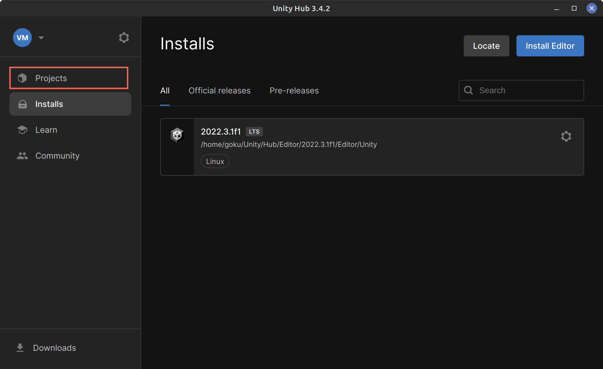
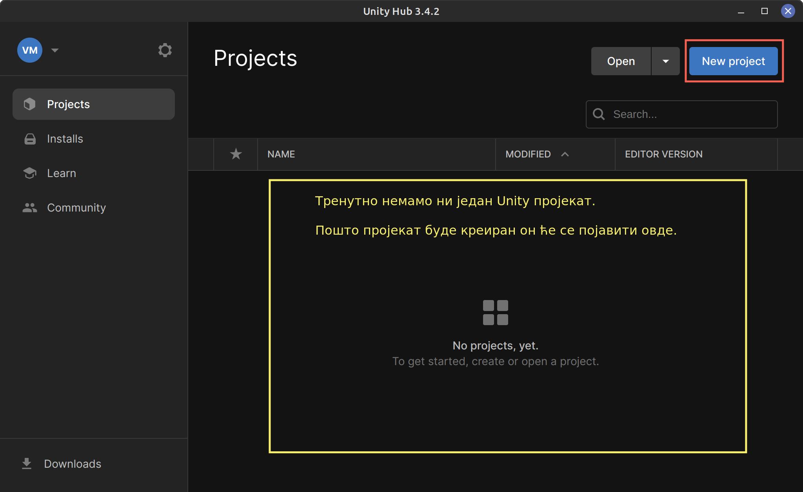
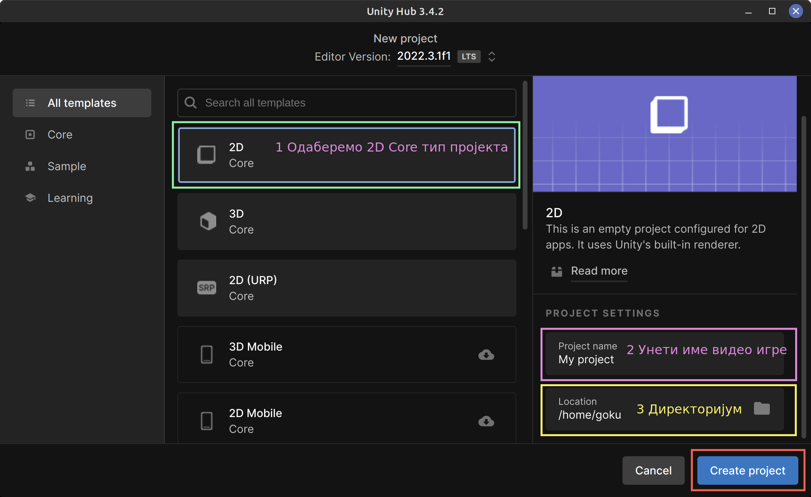
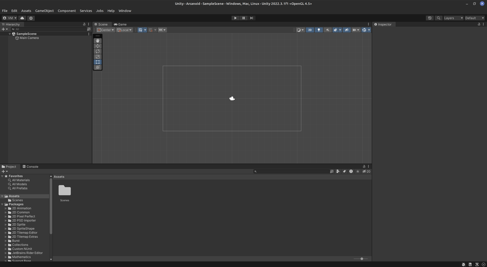

# Креирање пројекта за 2Д видео игру

Отворити Unity Hub и притиснути Projects таб.  

Кликнути New Project.  

На овој страни треба урадити више ствари:
1. Изабрати 2D Core тип пројекта.
2. Унети име пројеката.
3. Изабрати локацију за пројекат
4. Кликнути Create.  

Unity Hub ће аутоматски отворити Unity Editor са новим пројектом.  

