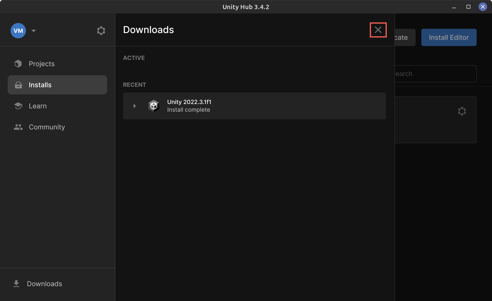

# Инсталација Unity окружења на Ликунксу

## Инсталирање Unity Hub
Unity Hub је апликација која помаже у управљању различитим верзијама Јунити окружења на рачунару. Разлог зашто ова апликација постоји је што је веома често да на једном рачунару имамо по неколико верзија Јунитија.

Јунити верзије се објављују релативно често. Овде увек можемо да видимо које верзије имамо инсталиране, да добавимо нову верзију, уклонимо стару и проверимо који пројекти (игре) користе које верзије едитора.

Инструкције за инсталацију Unity Hub-а су на овом линку: [Unity linux install](https://docs.unity3d.com/hub/manual/InstallHub.html#install-hub-linux)

## Инсталирање Unity едитора

Отвори Јунити Хаб  

Имамо две могућности:
1. "Sign in" ако већ имамо Јунити налог, онда можемо одмах да се пријавимо.
2. "Create account" ако немамо Јунити налог, онда овде можемо да га креирамо.

Ако се прозор за помоћ појави, само кликни "Got it".  

Прескaчемо (Skip) предложену инсталацију едитора. За овај туторијал хоћемо сами да одаберемо верзију за коју је туторијал прављен.   

Одабирамо Installs таб и кликнемо Install Editor.  

Потребна нам је 2022.3.1f1 LTS верзија. Притисни Install дугме за ову верзију.  

Овде селектујемо платформе (iPhone, Android, Windows, ...) за које желимо да развијамо видео игре. Ово је могуће променити касније па ћемо сада додати само Линукс јер је то платформа на којој развијамо игру. Затим притиснемо Install да би стартовали инсталацију.  

Инсталација је сада у току. У зависности од брзине интернета, инсталација може дуго да потраје.  

Ево како прозор изгледа после успешне инсталације. Кликнемо Х да затворимо Download прозор.

