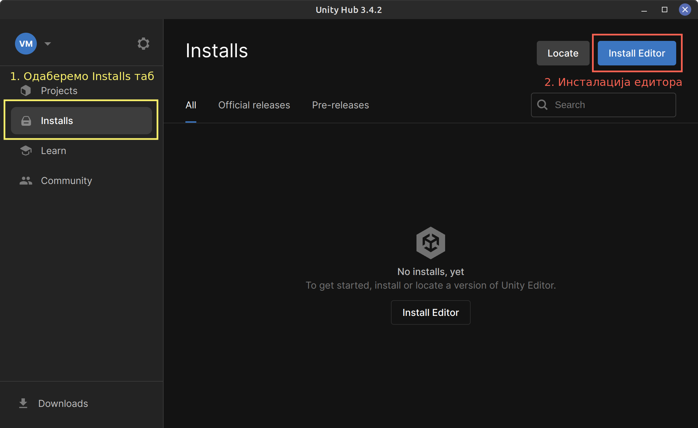
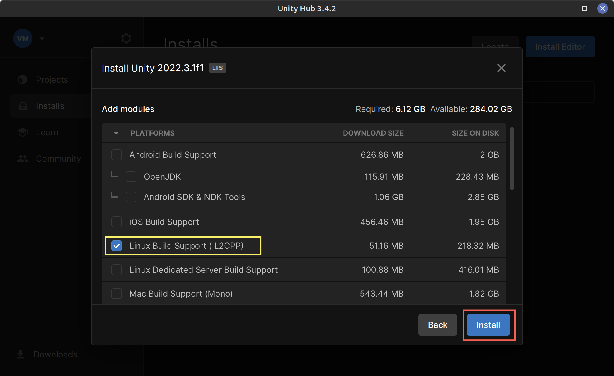

# Unity Installation on Linux

## Install Unity Hub
Go to [Unity linux install](https://docs.unity3d.com/hub/manual/InstallHub.html#install-hub-linux) official web page and follow the install instructions for Linux.

## Install Unity Editor
Unity Hub is an application which manages (install / uninstall) a different Unity versions. The reason why it exists is because it's not uncommon that you have multiple Unity versions installed at the same time.

Open Unity Hub  

Click on:
1. "Sign in" if you already have an account.
2. "Create account" if you need to create a new account.

If tool tip window shows up. Just click "Got it".  

Skip suggested installation.  

On Installs tab click on Install Editor.  

We want 2022.3.1f1 LTS version. Click Install button for this version.  

Now we need to select platforms (iPhone, Android, Windows, ...) for which we want to develop our game. This can be changed latter so for now we will only select: Linux Build Support. Then we click Install to start the installation.  

Installation is now in progress. Depending on internet connection this might take a while.  

Here is how Unity Hub will look like after completed installation. We can close Downloads pop-up window.  

